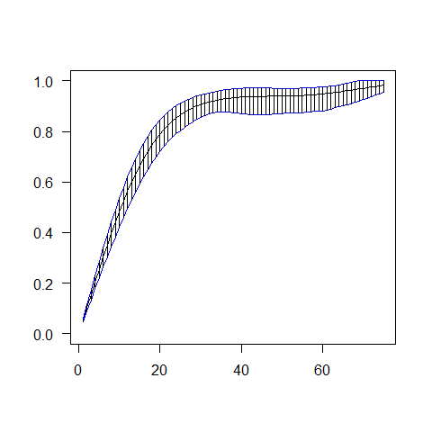

<!-- README.md is generated from README.Rmd. Please edit that file -->
curstatCI
=========

The goal of curstatCI is to obtain confidence intervals for the distribution fuccntion of a random variable based on current status data. In the current status model, the variable of interest *X* with distribution function *F*<sub>0</sub> is not observed directly. A censoring variable *T* ∼ *G* is observed instead together with the indicator *Δ* = (*X* ≤ *T*). *curstatCI* provides functions to estimate the distribution function *F*<sub>0</sub> and to construct pointswise confidence intervals around *F*<sub>0</sub>(*t*) based on an observed sample (*T*<sub>1</sub>, *Δ*<sub>1</sub>),…,(*T*<sub>*n*</sub>, *Δ*<sub>*n*</sub>) of size *n* from the observable random vector (*T*, *Δ*).

Installation
------------

You can install curstatCI from github with:

``` r
# install.packages("devtools")
devtools::install_github("pietg/curstatCI")
```

Example
-------

This is a basic example which shows you how to obtain the confidence intervals for the distribution function of the time to infection for the Rubella data set. More information on the data and usage of the package can be found in the vignette "curstatCI"

``` r
library(Rcpp)
library(curstatCI)
data(hepatitisA)
grid <-1:80
out=ComputeConfIntervals(data=hepatitisA,x=grid,alpha=0.05)
#> 
#> Piet Groeneboom and Kim Hendrickx 2017
#> For further information see:
#> The nonparametric bootstrap for the current status model,
#> Piet Groeneboom & Kim Hendricx, Electronical Journal of Statistics (2017).
#> 
#> The program produces the Studentized nonparametric bootstrap confidence intervals for the cdf, using the SMLE
#> 
#> 
#> Number of unique observations:     83
#> 
#> Sample size N =  850
#> 
#> 
#> The computations took    1.587   seconds

left<-out$CI[,1]
right<-out$CI[,2]

plot(grid, out$SMLE,type ='l', ylim=c(0,1), main= "",ylab="",xlab="",las=1)
lines(grid, left, col = 4)
lines(grid, right, col = 4)
segments(grid,left, grid, right)
```


